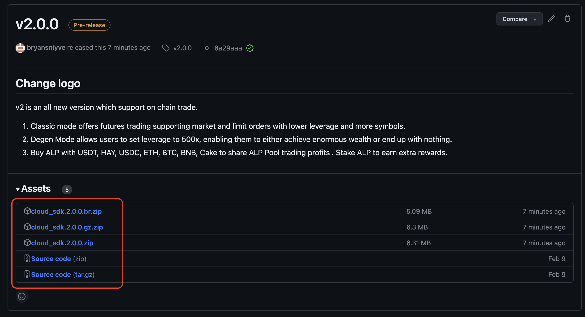
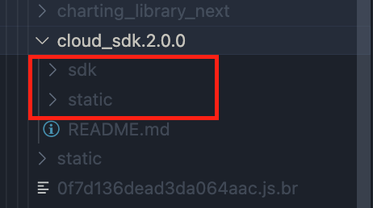

# ApolloX Broker Web SDK 2.0

### We launched sdk v2.0 which support On Chain Perp recently

1. You still can use v1 trade sdk . [Go to v1.0](https://github.com/apollox-broker/apollox-broker-web-sdk/tree/v1)

1. How to migration from v1 to v2. [Go to migration guide](./MigrationToV2.md)

1. [Permissionless DEX Engine Product Introduction](./PermissionlessIntroduction.md)

- [AWS Onboarding Process](#aws-onboarding-process)
- [Download the Latest SDK](#download-the-latest-sdk-v200)
- [Configs](#configs)
- [Events](#events)
- [Color Palette](#color-palette)
- [Proxy Setup](#proxy-setuponly-if-you-change-the-api-domain-in-sdk)
- [FAQ](#faq)

## AWS Onboarding Process

We take AWS service as an example to demostrate the whole process that you can get onboarded.
You can use other service on other cloud platform of course.

Before we start, make sure you set up AWS CLI [https://docs.aws.amazon.com/cli/latest/userguide/getting-started-install.html](https://docs.aws.amazon.com/cli/latest/userguide/getting-started-install.html)

### Step1. Upload SDK

Download the latest version of SDK zip file in [Releases](https://github.com/apollox-finance/broker-web-sdk/releases).



Unzip the file and upload those 2 folders(static, sdk) to AWS S3 space.

```sh
wget <zip-url> # download zip file from github
unzip <fileanme.zip> # unzip the zip file


aws s3 mb s3://apx-s3-test # create s3 bucket: apx-s3-test

# upload sdk folder to s3, and grant to all user
aws s3 sync ./sdk s3://apx-s3-test/sdk --grants read=uri=http://acs.amazonaws.com/groups/global/AllUsers

# upload static folder to s3, and grant to all user
aws s3 sync ./static s3://apx-s3-test/static --grants read=uri=http://acs.amazonaws.com/groups/global/AllUsers

```

### Step2. Initialize SDK

```sh
# initialize npm and packages
npm init
npm install local-web-server
```

create `lws.config.js` and paste below

```js
module.exports = {
  rewrite: [
    {
      from: "/bapi/(.*)",
      to: "https://www.apollox.finance/bapi/$1",
    },
    {
      from: "/fapi/(.*)",
      to: "https://www.apollox.finance/fapi/$1",
    },
    {
      from: "/cloud-futures/(.*)",
      to: "https://static.apollox.com/cloud-futures/$1",
    },
    {
      from: "/api/(.*)",
      to: "https://static.apollox.com/api/$1",
    },
  ],
  directory: "./",
  logFormat: "stats",
};
```

Create a index.html(can be skipped if you already have)
Import the static files that you just uploaded and init the trading page.

```html
<!DOCTYPE html>
<html>
  <head>
    <meta charset="utf-8" />
    <meta name="viewport" content="width=device-width" />
    <title>My Futures Exchange</title>
    <link rel="icon" type="image/x-icon" href="favicon.ico" />
    <style>
      html,
      body {
        margin: 0;
        padding: 0;
        width: 100vw;
        height: 100vh;
      }

      #app {
        width: 100%;
        height: 100%;
        overflow: hidden;
      }
    </style>
    <script src="/sdk/sdk.2.0.0.js"></script>
  </head>
  <body>
    <div id="app"></div>
    <script>
      const { origin, protocol } = window.location;
      const isDev = protocol === "http:";

      FuturesSDK.createTradeUI({
        container: document.getElementById("app"),
        config: {
          staticBaseUrl: `/static/`,
          futuresWsHost: "wss://fstream.apollox.finance/plain",
          // It's important!!! DO NOT use origin in production because request will be proxied by client's server to APX domain, then `/common-check-ip` api will detect ip through client's server IP, that'll be wrong. It should detect user's ip.
          apiBaseUrl: isDev ? origin : undefined, // in production, you don't need to configurate this, it's default as APX's url
          headerConfig: {},
          lightPalette: {
            primaryHover: "#6B78EE", // background hover
            primary: "#584CEA", // background; text hover,
            sellHover: "#FD5CB7",
            sell: "#EF3E9E",
            buyHover: "#3CC6BE",
            buy: "#1DB1A8",
          },
          defaultTheme: "light",
        },
        state: {
          symbol: "BTCUSD",
          lng: "en",
        },
      });
    </script>
  </body>
</html>
```

Then, run the local server and open [http://127.0.0.1:3333](http://127.0.0.1:3333/), you will see your exchange website is ready!

```
./node_modules/.bin/ws --port 3333
```

### Step3.Deploy

Deploy the index.html to AWS sever under your domain.

Now, you can visit trading page.

```sh
aws s3 cp ./index.html s3://apx-s3-test/index.html --grants read=uri=http://acs.amazonaws.com/groups/global/AllUsers

```

## Download the Latest SDK (v2.0.0)

You can find SDK in the release list
Releases list: [https://github.com/apollox-finance/broker-web-sdk/releases](https://github.com/apollox-finance/broker-web-sdk/releases), and download the latest zip file


## Usage

Unzip the file and upload those 2 folders to your CDN.


Import `sdk.js` and initialize SDK.

```html
<!DOCTYPE html>
<html>
  <head>
    <meta charset="utf-8" />
    <meta name="viewport" content="width=device-width" />
    <title>My Futures Exchange</title>
    <link rel="icon" type="image/x-icon" href="favicon.ico" />
    <style>
      html,
      body {
        margin: 0;
        padding: 0;
        width: 100vw;
        height: 100vh;
      }

      #app {
        width: 100%;
        height: 100%;
        overflow: hidden;
      }
    </style>
    <script src="/sdk/sdk.2.0.0.js"></script>
    <!-- the url of sdk in your CDN -->
  </head>
  <body>
    <div id="app"></div>
    <script>
      const { origin, protocol } = window.location;
      const isDev = protocol === "http:";

      FuturesSDK.createTradeUI({
        container: document.getElementById("app"),
        config: {
          staticBaseUrl: `/static/`, // the url of static folder in your CDN
          // It's important!!! DO NOT use origin in production because request will be proxied by client's server to APX domain, then `/common-check-ip` api will detect ip through client's server IP, that'll be wrong. It should detect user's ip.
          apiBaseUrl: isDev ? origin : undefined, // in production, you don't need to configurate this, it's default as APX's url
          headerConfig: {},
          lightPalette: {
            primaryHover: "#6B78EE", // background hover
            primary: "#584CEA", // background; text hover,
            sellHover: "#FD5CB7",
            sell: "#EF3E9E",
            buyHover: "#3CC6BE",
            buy: "#1DB1A8",
          },
          defaultTheme: "light",
        },
        state: {
          symbol: "BTCUSD",
          lng: "en",
        },
      });
    </script>
  </body>
</html>
```

## Configs

```ts
type Config = {
  staticBaseUrl: string;
  apiBaseUrl: string;
  brandName?: string;
  brokerId: number;
  i18nBaseUrl: string;
  configBaseUrl: string;
  darkPalette?: Partial<PaletteInterface>;
  lightPalette?: Partial<PaletteInterface>;
  enableThemeToggle?: boolean;
  isTestnet?: boolean;
  supportNetworks?: SupportedNetwork[];
  supportLanguages?: SupportedLanguage[];
  headerConfig: HeaderConfig;
  shareImgFolder?: string;
  loadingImage?: LoadingImage;
  notificationPosition?: NotificationPosition;
  defaultTheme?: "dark" | "light";
  fontFamily?: string;
  fontUrl?: string;
  variants?: Variants;
};
```

### staticBaseUrl

the base url of your static files, for example: the complete url of um_futures.{version}.html would be: `${staticBaseUrl}um_futures.{version}.html`

### apiBaseUrl

the base url of the api calls, for example: `${apiBaseUrl}/fapi/v1/exchangeInfo`

### brandName

the brand name of customer

### brokerId

will be used when user open position, recorded on the chain

### i18nBaseUrl

the i18n base url

### configBaseUrl

the config base url

### lightPalette, darkPalette

We support theme styles, you can customize the colors for light mode or dark mode, see [color palette](#color-palette).

```ts
type PaletteInterface = {
  modalBg: string;
  popupBg: string;
  inputBg: string;
  bg1: string; // default backgroud; dropdown backgroud; tooltip backgroud
  bg2: string;
  bg3: string; // disable/hover backgroud; disable line
  bg4: string;
  bg5: string; // navigation backgroud; mask backgroud
  bg6: string; // shadow
  alertYellowBg: string;
  badgeYellowBg: string;
  primaryHover: string;
  primary: string;
  toastFailBg: string;
  depthSellBg: string;
  sellHover: string;
  sell: string;
  toastSuccessBg: string;
  depthBuyBg: string;
  buyHover: string;
  buy: string;
  overallBg: string;
  moduleBg: string;
  newLine: string;
  t: {
    primary: string;
    secondary: string;
    third: string;
    disabled: string;
    yellow: string;
    sell: string;
    buy: string;
    white: string;
    emphasize: string;
  };
  slider: {
    line: string;
    disabledBar: string;
    progressBar: string;
    tooltipText: string;
    tooltipBg: string;
    radioButtonBg: string;
    radioButtonBorderColor: string;
    stepperBg: string;
    stepperBorderColor: string;
  };
};
```

### supportNetworks

default is ['bnb']

```ts
export type SupportedNetwork = "bnb";
```

### supportLanguages

default is all languages

```ts
export type SupportedLanguage =
  | "de"
  | "uk-UA"
  | "ru"
  | "fr"
  | "zh-CN"
  | "ko"
  | "zh-TW"
  | "pt-BR"
  | "en"
  | "es"
  | "es-LA"
  | "th"
  | "ja"
  | "pl"
  | "tr";
```

### headerConfig

the config to set up header

```ts
// all navTo support `%lng%` placeholder, can be relpaced with language

type MenuItem = {
  text: string | Record<SupportedLanguage, string>;
  navTo: string;
  navTarget?: "_blank" | "_parent"; // default '_blank', the target attribute if <a> element, see https://www.w3schools.com/tags/att_a_target.asp
};

type HeaderConfig = {
  disable?: boolean; // hide header

  logo?: {
    darkImgUrl: string;
    lightImgUrl: string;
    navTo?: string;
    navTarget?: "_blank" | "_parent"; // default '_parent'
  };

  menu?: {
    data: MenuItem[];
    placement?: "left" | "center"; // default 'center'
  };

  token?: {
    imgUrl: string; // the image url of the token
    navTo?: string; // the href url on the token
    navTarget?: "_blank" | "_parent"; // default '_blank'
    pricePrecision: number; // the precision u want to display
    network: SupportedNetwork; // token network
    lpPairAddress: string; // the contract address of the pair in liquidity pool, for example: https://bscscan.com/address/0xa0ee789a8f581cb92dd9742ed0b5d54a0916976c is the address of APX/BUSD in pancake pool
    lpBaseAddress: string; // the base asset address in the lp pair
    lpQuoteAddress: string; // the quote asset address in the lp pair
    quote?: {
      // Only config it when you must compute twice. For APX token which has configured APX/BUSD lp, add BUSD/USDT lp here, then you can get USDT price of APX
      lpPairAddress: string;
      lpBaseAddress: string;
      lpQuoteAddress: string;
    };
  };

  customerService?: {
    navTo: string;
    navTarget?: "_blank" | "_parent"; // default '_blank'
  };
};
```

<details>
  <symmary>Examples</summary>

```ts
// for bnb chain, BABY/BUSD pair
lpPairAddress: '0xe730c7b7470447ad4886c763247012dfd233baff', // BABY/USDT lp address
lpBaseAddress: '0x53e562b9b7e5e94b81f10e96ee70ad06df3d2657', // BABY contract address
lpQuoteAddress: '0x55d398326f99059ff775485246999027b3197955', // BUSD contract address

// for eth chain, UNI/DAI pair
lpPairAddress: '0xc34fecf98a7c48ee48288fc163ca5804d3235be5', //  UNI/DAI lp address
lpBaseAddress: '0x1f9840a85d5af5bf1d1762f925bdaddc4201f984', // UNI address
lpQuoteAddress: '0x6b175474e89094c44da98b954eedeac495271d0f', // DAI address
tokenNetwork: 'eth',

// for arb1 chain, WETH/USDC pair
lpPairAddress: '0x905dfcd5649217c42684f23958568e533c711aa3', // WETH/USDC lp address
lpBaseAddress: '0x82af49447d8a07e3bd95bd0d56f35241523fbab1', // WETH address
lpQuoteAddress: '0xff970a61a04b1ca14834a43f5de4533ebddb5cc8', // USDC address
tokenNetwork: 'arb1',
```

</details>

### shareImgFolder

default value: `static/images/share-poster`

set up the images for share poster
the image list:

- `${shareImgFolder}/light_logo.png`
- `${shareImgFolder}/dark_logo.png`
- `${shareImgFolder}/pc_light_win.png`
- `${shareImgFolder}/pc_dark_win.png`
- `${shareImgFolder}/pc_light_loss.png`
- `${shareImgFolder}/pc_dark_loss.png`
- `${shareImgFolder}/mobile_light_win.png`
- `${shareImgFolder}/mobile_dark_win.png`
- `${shareImgFolder}/mobile_light_loss.png`
- `${shareImgFolder}/mobile_dark_loss.png`

### loadingImage

the loading image config, it will show before the trade page render

```ts
type LoadingImage = {
  url: string;
  width?: number;
  backgroundColor?: string;
};
```

### notificationPosition

the position of all notification toast

```ts
type NotificationPosition = {
  horizontal: "left" | "right";
  vertical: "top" | "bottom";
};
```

### defaultTheme

to configure the initial theme value, theme value will then be stored in cookies with key 'theme'

### fontFamily

same as https://www.w3schools.com/cssref/pr_font_font-family.asp

### fontUrl

the url of the custom font

### variants

experimental feature, for customized style

```ts
type Variants = {
  widget: Record<string, CSSProperties>;
};
```

<details>
  <summary>example</summary>

```js
variants: {
  widget: {
    default: {
      borderRadius: '16px',
      border: '1px solid',
      borderColor: 'primary'
    }
  },
  button: {
    default: {
      borderRadius: '16px'
    }
  },
  orderform: {
    inputWrapper: {
      borderRadius: '16px',
    }
  }
}
```

</details>

## Events

We also support several event to let u can customize the exchange more flexible

```js
FuturesSDK.eventListener.on("symbolChange", (data) => {
  console.log("symbol change", data.symbol);
  window.history.replaceState(
    {},
    null,
    `/${getLngFromUrl()}/futures/${data.symbol}`
  ); // assume the url is formaated as /:lng/futures/:symbol
});
FuturesSDK.eventListener.on("invalidSymbol", () =>
  console.log("invalid symbol")
);
FuturesSDK.eventListener.on("startLoad", () =>
  console.log("startLoad event received")
);
FuturesSDK.eventListener.on("lngChange", (data) => {
  console.log("lng change", data.lng);
  window.history.pushState(
    {},
    null,
    `/${data.lng}/futures/${getSymbolFromUrl()}`
  ); // assume the url is formaated as /:lng/futures/:symbol
});
```

## Color Palette

[https://www.figma.com/file/OH3FtJJ8I7EbVNrG6bupIs/Broker-Color-Usage?node-id=0%3A1](https://www.figma.com/file/OH3FtJJ8I7EbVNrG6bupIs/Broker%E2%80%A8-Color-Usage?node-id=0%3A1)
password: 0706

## Proxy Setup(only if you change the API domain in SDK)

### API

```
https://api.your.domain/bapi/* --- proxy to --> https://www.apollox.finance/bapi/*
https://api.your.domain/fapi/* --- proxy to --> https://www.apollox.finance/fapi/*
```

### WS

```
wss://fstream.your.domain/compress/stream --- proxyt to --> wss://fstream.apollox.finance/compress/stream
```

### Static files

```
https://static.your.domain --- proxy to --> https://static.apollox.com
```

## FAQ

### Q: How to remove the theme toggle component?

Set `config.enableThemeToggle` to false.

### Q: How to change the font?

Set `config.fontFamily`, or set `config.fontUrl` for custom font.

### Q:How to set the price display on the navigation bar?

There are few configs related to the price display:

- `config.headerConfig.token.pricePrecision`: the precision u want to display
- `config.headerConfig.token.lpPairAddress`: the contract address of the pair in liquidity pool, for example: 0xa0ee789a8f581cb92dd9742ed0b5d54a0916976c is the address of APX/BUSD in pancake pool
- `config.headerConfig.token.lpBaseAddress`: the base asset address in the lp pair
- `config.headerConfig.token.lpQuoteAddress`: the quote asset address in the lp pair

Before is only need if you want to compute twice. For APX token which has configured APX/BUSD lp, add BUSD/USDT lp here, then you can get USDT price of APX

- `config.headerConfig.token.quote.lpPairAddress`: the contract address of the pair in liquidity pool, for example: 0xa0ee789a8f581cb92dd9742ed0b5d54a0916976c is the address of APX/BUSD in pancake pool
- `config.headerConfig.token.quote.lpBaseAddress`: the base asset address in the lp pair
- `config.headerConfig.token.quote.lpQuoteAddress`: the quote asset address in the lp pair

### Q: How to change title or favicon?

Our SDK just generates an iframe into your specified DOM, so you can change the title or favicon in your HTML as normal. See [w3school](​​https://www.w3schools.com/howto/howto_html_favicon.asp)

### Q: How to change the logo on the header? How to add the url on logo?

Since we have two themes, dark and light, and also care about the RWD, we have 5 configs related to the logo.

- `config.headerCnfig.logo.darkImgUrl`: the image url for dark theme
- `config.headerCnfig.logo.lightImgUrl`: the image url for light theme

### Q: How to change border-radius of the widgets

Use `config.variants.widget.default` to change the style of the widgets.

### Q: Hot to migrate to latest SDK

1. Go to [releases](https://github.com/apollox-finance/broker-web-sdk/releases) and download the latest SDK zip.
2. Unzip the file, and upload to your CDN.
3. Update the sdk version in your HTML file `<script src="/sdk/sdk.2.0.0.js"></script>`

### Q：Why 'wss://perp-qa.pancakeswap.finance/plain/stream' return 404 in QA?

Becasue SDK V2 is permissionless (that means no more whitelist as SDK V1), Please use our production api
`wss://fstream.apollox.finance/plain` replace of `wss://perp-qa.pancakeswap.finance/plain/stream` (which been used in SDK v1 QA).
if using `wss://fstream.apollox.finance/plain` still return ws error, try to `clean site data` under `Application` tab in chrome devtools maybe work.

### Q: What are the `br` and `gz`

`br` => `brotil`
`gz` => `gzip`

They are the two most common compression algorithms, widely used in modern web. They help user can download data faster.
Check out the article to know more: https://www.siteground.com/blog/brotli-vs-gzip-compression/

### Q: How to use `br` and `gz` static file

Same as before, just ensure you download the `br.zip` or `gz.zip` version.

1. Go to [releases](https://github.com/apollox-finance/broker-web-sdk/releases) and download the latest SDK zip file.
2. Unzip the file, and upload to your CDN.
3. Update the sdk version in your HTML file `<script src="/sdk/sdk.2.0.0.js"></script>`

### Q: How to integrate the sdk with customized url (e.g. /en/futures/BTCUSD)

1. Make sure `/:lng/futures/:symbol` can redirect to your html. Normally, this is configured by your infra team.
2. Parse the url to get `lng`, `symbol`

```js
function getLngFromUrl() {
  return location.pathname.split("/")[1] || "en";
}

function getSymbolFromUrl() {
  return location.pathname.split("/")[3] || "BTCUSD";
}
```

3. Give the SDK lng and symbol that you get from url

```js
FuturesSDK.createTradeUI({
  // ... other configs
  state: {
    symbol: getSymbolFromUrl(),
    lng: getLngFromUrl(),
  },
});
```

4. Listen `lngChange` and `symbolChange` events, to change the pathname when lng or symbol changes.

```js
FuturesSDK.eventListener.on("symbolChange", (data) => {
  window.history.replaceState(
    {},
    null,
    `/${getLngFromUrl()}/futures/${data.symbol}`
  );
});
FuturesSDK.eventListener.on("lngChange", (data) => {
  window.history.pushState(
    {},
    null,
    `/${data.lng}/futures/${getSymbolFromUrl()}`
  );
});
```

You can check out the full code here: https://github.com/apollox-finance/broker-web-sdk/blob/main/examples/basic/index.html
